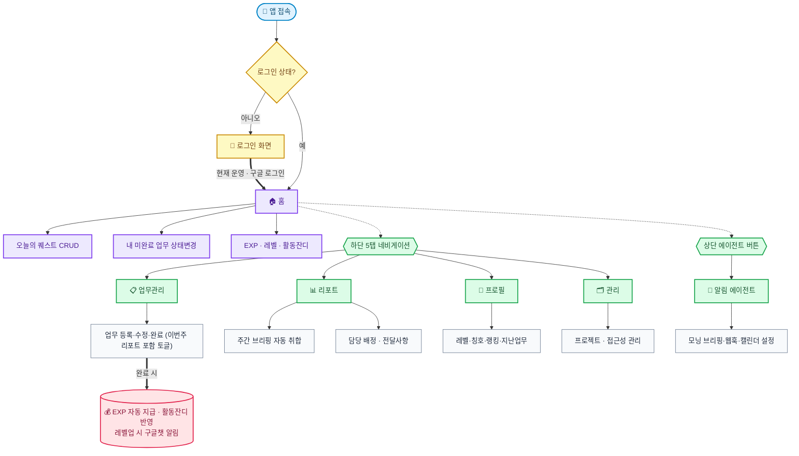
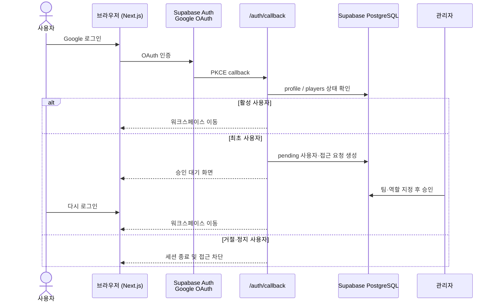

# 🧩 UD2팀 업무 관리 앱

> UD2 퍼블리싱팀 전용 업무 관리 웹앱  
> 업무 등록 → 자동 취합 → 주간 브리핑까지 한 곳에서

**🔗 배포 URL:** https://project-alarm-service.vercel.app  
**🔒 접근:** 회사 구글 계정 로그인 → 미등록 사용자는 관리자 승인 후 이용

**📱 PWA:** 홈 화면 / 작업 표시줄에 앱으로 설치 가능

---

## 🗺️ 한눈에 보기

> 처음 보는 사람도 "어떤 서비스인지" 흐름으로 파악할 수 있는 사용자 동선이에요.
> 
> 🟦 진입 · 🟨 인증 · 🟪 홈 · 🟩 5탭 기능 · 🟥 보상



---

## 📌 주요 기능

### 🏠 홈
- 본인 EXP / 레벨 / 출석 체크 현황
- 활동 잔디 히트맵 (출석 + 업무 완료 + 퀘스트 완료 합산)
- 오늘의 퀘스트 CRUD (추가 / 수정 / 삭제 / 완료)
  - "+ 추가" 버튼 모달로 등록 (프로젝트 react-select 검색 연동, Tiptap 내용 편집)
  - 오늘 기간에 걸친 내 업무는 퀘스트 목록에 자동 포함 (개별 제외 가능)
  - 드래그로 퀘스트 순서 변경 (정렬)
  - 마감 임박(D-3 이내) 퀘스트 강조
- 내 미완료 업무 목록 (상태 변경 가능)
- 레벨업 시 confetti 애니메이션 + 팀 전체 구글챗 알림
- 완료/퀘스트/출석 시 EXP 팝업 애니메이션

### 📋 업무 관리
- 업무 추가 / 수정 / 삭제
- 담당자 / 구분 / 우선순위 / 기간 / 공수 설정
- **이번주 리포트 포함 토글** — 업무 노출 조건이 아니라 주간 리포트 포함 여부를 관리
- DayPicker로 기간 선택 (연/월 드롭다운 지원)
- 상태 변경 (대기 → 시작 전 → 진행중 → 지연/보류 → 완료)
- 완료 시 EXP 자동 지급 + 활동 잔디 반영
- **미완료 업무 전체 기준** 표시 (지난 업무라도 완료되지 않았으면 계속 표시)
- Realtime 동기화
- **권한:** 본인 업무만 수정/삭제 (관리자는 전체)

### 📊 리포트
- 주간 / 월간 탭 전환
- **주간 전달사항** — 관리자가 Tiptap 에디터로 작성 (B/I/H1/H2/목록 지원)
- **주간 브리핑** — 등록된 업무 기반 자동 생성
  - 프로젝트 / 유지보수 / 기타 / 이번주 리포트 포함 업무 섹션 자동 취합
  - **목요일 00:00~18:00** 에만 편집 가능 (편집 버튼으로 토글)
  - 섹션별 Copy 버튼 (노션 붙여넣기 지원)
- **담당 배정** — 배정현황 / 배정대기 관리
  - URL 하이퍼링크 지원
  - 배정대기 사업기간 메모
  - Copy 버튼으로 전체 복사
- 팀원별 상세 아코디언

### 👤 프로필
- 레벨 / EXP / 출석 체크
- 획득한 칭호 배지 표시
- EXP 랭킹 (이번 달 기준)
- 이번 주 팀원별 공수 바
- 지난 업무 조회 (기간 / 프로젝트 / 상태 필터)
- 탭 구성: 내 정보 · 지난 업무 · 완료 퀘스트(되돌리기 가능) · 성장(레벨 가이드 + 획득·미획득 칭호)
- 프로필 이미지 업로드 (인스타그램 스타일 액션 시트)

### 🗂️ 관리
- **프로젝트 관리**
  - 팀 전체 프로젝트 목록 (담당자 / 언어 / PM / 개발자 / 디자이너 / 빈도 / 이전담당 / 비고)
  - 아코디언 UI + 검색 / 담당자 / 언어 필터 + 가나다순 / 담당자순 정렬
  - react-select 검색 연동
- **접근성 관리**
  - 팀 전체 접근성 인증 현황
  - 상태: 신청필요 / 신청완료 / 취득·갱신완료 / 신청불필요
  - D-14 이내 빨간 강조, D-15~45 주황 강조
  - 신규 프로젝트 NEW 배지
  - pg_cron으로 만료 D-60에 자동 신청필요 변경
  - 알림 에이전트: 신청필요/신청완료/갱신 필요 상태를 담당자 기준으로 브리핑과 미션 팝업에 반영

### 🤖 알림 에이전트
- 개인 Google Chat DM webhook 등록
- 관리자의 팀원별 webhook 대리 등록
- Google Calendar 연결 및 오늘 일정 동기화
- 개인 모닝 브리핑 미리보기와 테스트 발송
- Vercel Cron 기반 자동 모닝 브리핑 발송

---

## 🎮 게이미피케이션

업무 완료, 출석, 퀘스트 완료를 활동 기록으로 반영합니다.  
점수 계산은 클라이언트에서 직접 처리하지 않고 서버 RPC를 통해 반영합니다.

### 레벨 시스템

| 레벨 | 이름 | 필요 EXP |
|------|------|----------|
| Lv.1 | 풋내기 모험가 | 0 |
| Lv.2 | 수련 중인 검사 | 500 |
| Lv.3 | 던전 탐험가 | 1,500 |
| Lv.4 | 이름난 용병 | 3,000 |
| Lv.5 | 보스 사냥꾼 | 7,000 |
| Lv.6 | 아케인 리버 개척자 | 15,000 |
| Lv.7 | 메이플 월드의 전설 | 35,000 |
| Lv.8 | 검은 마법사의 숙적 | 70,000 |

### EXP 반영 기준

| 행동 | 반영 |
|------|------|
| 업무 완료 | EXP 지급 및 활동 기록 반영 |
| 긴급 업무 완료 | 추가 EXP 지급 |
| 출석 체크 | EXP 지급 및 출석 기록 반영 |
| 퀘스트 완료 | EXP 지급 및 활동 기록 반영 |

### 칭호 시스템

| 칭호 | 조건 |
|------|------|
| 첫 완료 | 첫 번째 업무 완료 |
| 꾸준러 | 3일 연속 출석 |
| 주간 챔피언 | 7일 연속 출석 |
| 마감지킴이 | D-day 전 완료 5건 |
| 업무 달인 | 완료 10건 |
| 베테랑 | 완료 30건 |
| 긴급 해결사 | 긴급 업무 5건 완료 |
| 중급 탐험가 | 레벨 5 달성 |

### 활동 히트맵
- 출석 체크, 업무 완료, 퀘스트 완료를 합산해 활동량을 기록
- 최근 16주 기준으로 시각화
- Supabase Realtime으로 변경 사항 반영

### 주간 MVP
- 주간 EXP와 완료 업무 수를 기준으로 선정
- 앱 접속 시 지난주 결과를 확인
- 축하 오버레이로 결과 표시

---

## 🤖 자동화 (알림 에이전트)

Google Apps Script 중심 알림은 앱 내부 알림 에이전트로 전환 중입니다. 현재 모닝 브리핑은 Next.js Route Handler, Vercel Cron, Google Calendar OAuth, 팀원별 Google Chat 개인 webhook을 기준으로 운영합니다.

### 📨 모닝 브리핑
- **개인 DM**으로 발송
- 개인별 브리핑 발송 시간 설정
- Google Calendar 오늘 일정 자동 동기화
- 오늘의 퀘스트와 미완료 업무 포함
- 접근성 인증 만료/갱신 필요 항목 포함
- 발송 이력 저장 및 중복 발송 방지

### 🌐 접근성 인증 미션
- 담당자 본인 항목만 미션 팝업으로 표시
- 신청필요, 신청완료, 취득·갱신완료 상태에 따라 후속 액션 유도
- 상태/만료일 업데이트가 필요한 경우 접근성 관리 화면으로 이동

### 🎊 레벨업 알림
- 레벨업 시 Google Chat 알림 발송

### 배포/버전 업데이트 알림
- `main` push 시 GitHub Actions가 업데이트 소식을 생성
- 커밋 메시지의 `(vX.Y.Z)` 패턴을 기준으로 버전 추출
- 신규 버전이면 Git tag, GitHub Release, `notifications` 테이블 업데이트를 자동 처리

---

## 🏗 시스템 아키텍처

> 프로그래밍 관점에서 본 전체 구조예요.
> **현재 운영(main 출시본)** 은 클라이언트가 **Supabase에 직접 쿼리**(supabase-js + Realtime + RLS)하고,
> 로그인은 **Supabase 구글 OAuth**를 씁니다.
> 단, **점수(EXP·레벨·출석·잔디) 쓰기는 DB의 `SECURITY DEFINER` RPC**(`set_task_status`·`set_quest_done`·`attendance_check`)를 통해서만 이뤄져요 — 클라이언트의 점수 직접 쓰기는 차단(위조 방지).
> 관리자 변경 작업은 Next.js Route Handler를 경계로 처리하며, Spring Boot 전환 시
> 이 API 계약을 유지한 채 서버 구현만 단계적으로 교체합니다.

```mermaid
graph TB
    subgraph Client["🖥️ 클라이언트 · Next.js 16 (Vercel · PWA)"]
        UI["페이지 5탭 + 에이전트<br/>홈·업무·리포트·프로필·관리·알림"]
        MW["proxy 미들웨어<br/>쿠키 기반 인증 게이트"]
        AP["AuthProvider<br/>세션·역할 컨텍스트"]
    end

    subgraph Supa["🟢 Supabase · PostgreSQL"]
        SAuth["Supabase Auth<br/>구글 OAuth ✅ 현재 운영"]
        DB[("업무·리포트·알림 테이블 · RLS")]
        RT["Realtime 구독"]
        Store["Storage · avatars"]
    end

    subgraph NextAPI["⚙️ Next.js Route Handlers · /api"]
        Notify["/api/notify · 구글챗 프록시"]
        AdminAPI["/api/admin/* · 관리자 권한/변경"]
        AgentAPI["/api/agents/* · 알림 에이전트"]
    end

    subgraph Spring["☕ Spring Boot — 단계적 이전 예정"]
        AdminCore["Supabase 토큰 검증<br/>관리자 유스케이스 API"]
    end

    subgraph Ext["🤖 외부 자동화"]
        VercelCron["Vercel Cron<br/>모닝 브리핑"]
        Calendar["Google Calendar<br/>오늘 일정"]
        Cron["pg_cron<br/>접근성 만료 갱신"]
        Chat["Google Chat"]
    end

    UI -->|"로그인 ✅ 현재"| SAuth
    UI -->|"데이터 직접 쿼리"| DB
    UI -->|"구독"| RT
    UI -->|"이미지 업로드"| Store
    UI --> MW
    UI -->|"레벨업 알림"| Notify --> Chat
    UI -->|"브리핑·웹훅 설정"| AgentAPI
    UI -->|"관리자 변경"| AdminAPI
    AdminAPI -.->|"향후 내부 호출"| AdminCore
    VercelCron --> AgentAPI
    AgentAPI -->|"service_role · 서버 전용"| DB
    AgentAPI --> Calendar
    AgentAPI --> Chat
    Cron --> DB

    classDef client fill:#dbeafe,stroke:#2563eb,color:#1e3a8a,stroke-width:1.5px;
    classDef api fill:#ede9fe,stroke:#7c3aed,color:#4c1d95,stroke-width:1.5px;
    classDef wip fill:#fde68a,stroke:#d97706,color:#7c2d12,stroke-width:2px,stroke-dasharray:5 4;
    classDef data fill:#bbf7d0,stroke:#16a34a,color:#14532d,stroke-width:1.5px;
    classDef ext fill:#fbcfe8,stroke:#db2777,color:#831843,stroke-width:1.5px;

    class UI,MW,AP client;
    class AdminAPI,Notify,AgentAPI api;
    class AdminCore wip;
    class SAuth,DB,RT,Store data;
    class VercelCron,Calendar,Cron,Chat ext;

    style Client fill:#eff6ff,stroke:#2563eb;
    style Supa fill:#f0fdf4,stroke:#16a34a;
    style NextAPI fill:#f5f3ff,stroke:#7c3aed;
    style Spring fill:#fffbeb,stroke:#d97706,stroke-width:2px;
    style Ext fill:#fdf2f8,stroke:#db2777;
```



### 🔐 인증 및 접근 승인 흐름

현재 인증은 Supabase Google OAuth를 사용한다. 처음 로그인한 사용자는 접근 요청으로
등록되고, 관리자가 팀과 역할을 지정해 승인한 뒤 워크스페이스에 진입한다.



### 🗄 DB ER 다이어그램

> 실선(`||--o{`)은 외래키(FK) 관계, 점선(`||..o{`)은 이름·프로젝트명 문자열로 느슨하게 연결되는 관계예요.
> 대부분의 테이블은 `team_id`(text)로 팀을 구분합니다.
>
> 🚧 **FK 정규화 진행 중:** 점선(이름 문자열 조인) 관계를 `player_id`/`project_id` FK로 전환하는 작업이 진행 중이에요(Phase 1 완료 — `tasks`·`quests`·`attendance`·`accessibility`에 FK 컬럼 추가·백필·검증·동기화 트리거). 클라이언트 전환·텍스트 컬럼 제거가 끝나면 아래 점선들이 실선 FK로 바뀝니다.

```mermaid
erDiagram
    players ||--o{ notification_reads : "player_id"
    notifications ||--o{ notification_reads : "notification_id"
    tasks ||--o{ quests : "task_id"
    briefings ||--o{ briefing_tasks : "briefing_id"
    tasks ||--o{ briefing_tasks : "task_id"
    players ||..o{ tasks : "member(이름)"
    players ||..o{ quests : "member(이름)"
    players ||..o{ attendance : "member(이름)"
    players ||..o{ agent_member_webhooks : "email"
    players ||..o{ agent_calendar_connections : "email"
    players ||..o{ agent_calendar_events : "email"
    projects ||..o{ tasks : "proj(이름)"
    projects ||..o{ accessibility : "proj(이름)"
    agent_suggestions ||..o{ agent_notification_deliveries : "suggestion_id"

    players {
        bigint id PK
        text name
        text email
        text role "admin / member"
        int exp
        int level
        int week_exp
        text_array icons "칭호"
        int attend_streak
        text avatar_url
    }
    tasks {
        bigint id PK
        text member
        text proj
        text status
        text priority
        bool is_plan "이번주 리포트 포함"
        date start_date
        date end_date
    }
    quests {
        bigint id PK
        text member
        bigint task_id FK
        text status
        int order_index
    }
    projects {
        bigint id PK
        text name
        text_array members
        text language
        text pm
        bool is_archived
    }
    accessibility {
        bigint id PK
        text proj
        text inspection_status "신청필요 등 4종"
        date end_date
        bool is_new
    }
    briefings {
        bigint id PK
        text team_id
        date week_start
        text in_progress
        text done
        bool is_locked "리더 잠금"
    }
    briefing_tasks {
        bigint id PK
        bigint briefing_id FK
        bigint task_id FK
        text edited_content "Tiptap HTML"
        text team_id
    }
    assignments {
        bigint id PK
        text type
        text name
        text_array members
        text url
        text period_note
        text status
        int sort_order
    }
    attendance {
        bigint id PK
        text member
        date date
        int activity_count "출석+완료+퀘스트"
    }
    notifications {
        bigint id PK
        text version
        text title
        text body
        text commit_sha
    }
    notification_reads {
        bigint id PK
        bigint player_id FK
        bigint notification_id FK
    }
    agent_suggestions {
        bigint id PK
        text team_id
        text agent_type
        text status
        text dedupe_key
        text payload
    }
    agent_notification_deliveries {
        bigint id PK
        bigint suggestion_id
        text team_id
        text dedupe_key
        text channel
        text recipient_member
        text payload
    }
    agent_member_webhooks {
        bigint id PK
        text team_id
        text member
        text email
        text webhook_url
    }
    agent_calendar_connections {
        bigint id PK
        text team_id
        text member
        text email
        text google_email
    }
    agent_calendar_events {
        bigint id PK
        text team_id
        text member
        text email
        text google_event_id
        text title
        datetime starts_at
    }
    agent_member_notification_settings {
        bigint id PK
        text team_id
        text member
        text email
        text morning_send_time
        bool morning_enabled
    }
    audit_logs {
        bigint id PK
        text email
        text action "login_success 등"
        text ip
        timestamptz created_at
    }
```



---

## 🛠 기술 스택

| 분야 | 기술 |
|------|------|
| 프레임워크 | Next.js 16 (App Router) |
| 언어 | TypeScript |
| 스타일링 | Tailwind CSS |
| 데이터베이스 | Supabase (PostgreSQL) |
| 인증 (현재 운영) | Supabase Auth (Google OAuth) |
| 관리자 서버 경계 | Next.js Route Handler, 이후 Spring Boot로 계약 유지 이전 |
| 실시간 | Supabase Realtime |
| 배포 | Vercel (프론트) |
| 자동화 | Vercel Cron, Next.js Route Handler, GitHub Actions |
| 에디터 | Tiptap |
| 날짜 선택 | React DayPicker |
| 검색 Select | react-select |
| 드래그앤드롭 | @dnd-kit/core |
| 애니메이션 | Framer Motion + canvas-confetti |
| PWA | manifest.json + 아이콘 |
| 아이콘 | Remix Icon |

---

## 📁 프로젝트 구조

```
src/
├── proxy.ts                  # 미들웨어: 쿠키 기반 인증 게이트 (로그인 안 하면 /login)
├── app/
│   ├── page.tsx              # 홈 (퀘스트, 내 업무, EXP, 잔디)
│   ├── tasks/                # 업무 관리 (미완료 업무 전체 + 리포트 포함 여부)
│   ├── report/               # 리포트 (브리핑, 배정현황, 전달사항)
│   ├── profile/              # 프로필 (내정보, 지난업무, 성장)
│   ├── manage/               # 관리 (프로젝트, 접근성)
│   ├── agents/               # 알림 에이전트 (브리핑, 웹훅, 캘린더)
│   ├── changelog/            # 배포/버전 업데이트 소식
│   ├── login/ · pending/     # 구글 로그인 / 접근 승인 대기
│   ├── signup/               # 미사용 레거시 초대코드 화면
│   ├── admin/                # 관리자 대시보드·요청·구성원·팀·권한
│   ├── auth/callback/route.ts
│   └── api/
│       ├── admin/            # 관리자 조회·승인·역할·팀 변경 API
│       ├── agents/           # 알림 에이전트, Google Calendar, webhook API
│       ├── notify/route.ts   # 구글챗 웹훅 프록시
│       └── briefing-tasks/route.ts
├── components/
│   ├── Nav.tsx · Header.tsx · UserMenu.tsx       # 네비게이션/헤더
│   ├── AuthProvider.tsx · AuthGuard.tsx          # 인증 컨텍스트/보호
│   ├── auth/                                      # 로그인·가입 픽셀 UI 위젯
│   ├── Avatar.tsx · AttendanceHeatmap.tsx        # 아바타/활동 잔디
│   ├── LevelUpOverlay.tsx · MvpOverlay.tsx · ExpPopup.tsx  # 게이미피케이션 연출
│   ├── AccessibilityMissionPopup.tsx · AgentButton.tsx     # 접근성 미션/에이전트 바로가기
│   ├── TaskEditModal.tsx                          # 업무 편집 모달 (DragQuestModal.tsx는 현재 미사용)
│   └── Tiptap*Editor.tsx · NotificationButton.tsx
├── hooks/useNotifications.ts # 배포 알림 구독/읽음
└── lib/
    ├── supabase.ts           # Supabase 클라이언트 (데이터 직접 쿼리)
    ├── serverSupabase.ts     # 서버 세션·권한 및 service role 클라이언트
    ├── auth.ts               # 인증 유틸 (이메일→팀원명, GUEST 처리)
    ├── maple.ts              # EXP/레벨/잔디 로직
    ├── types.ts · constants.ts · utils.ts
    ├── reactSelectStyles.ts  # react-select 공통 스타일
    ├── agents/               # 알림 에이전트 후보/브리핑/발송 이력 로직
    ├── server/               # Google Calendar · Google Chat 서버 유틸
    └── googleChat.ts         # 구글챗 웹훅
```

---

## 🗄 Supabase 테이블

| 테이블 | 설명 |
|--------|------|
| `tasks` | 업무 목록 (`is_plan`은 이번주 리포트 포함 여부) |
| `players` | 팀원 EXP / 레벨 / 칭호 / 주간 EXP |
| `profiles` | 인증 사용자 프로필과 계정 상태 (V31 호환 전환) |
| `team_memberships` | 사용자-팀 N:M 소속, 기본 팀과 팀별 역할 |
| `access_requests` | 신규 사용자의 팀·역할 접근 승인 요청 |
| `teams` / `organization_admins` | 팀 생명주기와 조직 관리자 |
| `admin_audit_logs` | 관리자 변경 감사 로그 |
| `projects` | 프로젝트 목록 (멀티 담당자, 메타데이터) |
| `accessibility` | 웹 접근성 인증 관리 (is_new, 상태 4종) |
| `quests` | 오늘의 퀘스트 (task_id 연동) |
| `briefings` | 주간 브리핑 저장본 (잠금 지원) |
| `assignments` | 배정현황 / 배정대기 (URL, 사업기간 메모) |
| `attendance` | 활동 잔디 기록 (activity_count) |
| `briefing_tasks` | 업무별 브리핑 카드 편집본 (Tiptap HTML) |
| `notifications` / `notification_reads` | 배포·버전 업데이트 알림 + 읽음 처리 |
| `agent_suggestions` | 알림 에이전트 후보 |
| `agent_notification_deliveries` | 알림 발송 이력과 중복 방지 |
| `agent_member_webhooks` | 팀원별 Google Chat 개인 webhook |
| `agent_calendar_connections` | 팀원별 Google Calendar OAuth 연결 |
| `agent_calendar_events` | 동기화된 오늘 일정 |
| `agent_member_notification_settings` | 개인 브리핑 발송 시간과 설정 |
| `audit_logs` | 로그인 감사 로그 (login_success / failed / logout) |

모든 테이블 RLS 활성화. 서버 Route Handler와 자동화 경로에서만 `service_role key`를 사용합니다.
> ER 다이어그램은 위 [🗄 DB ER 다이어그램](#-db-er-다이어그램) 참고.

---

## 👥 권한 구조

| 역할 | 조건 | 권한 |
|------|------|------|
| 조직 관리자 | `organization_admins` 등록 | 모든 팀과 관리자 설정 |
| 팀 `admin` | `team_memberships.role = 'admin'` | 해당 팀 구성원·팀 운영 관리 |
| 팀 `member` | `team_memberships.role = 'member'` | 본인 업무/퀘스트 수정 |
| 팀 `viewer` | `team_memberships.role = 'viewer'` | 소속 팀 읽기 전용(전환 예정) |
| `guest` | @example.com 도메인, MEMBER_EMAILS 미포함 | 읽기 전용 |

V31 호환 기간에는 기존 화면이 `players.role`을 계속 사용하고, DB 트리거가
`team_memberships`와 동기화한다.

---

## 🔐 보안

> 사내 업무 데이터를 다루는 만큼, 인증·인가·데이터 격리·감사 측면에서 다음 조치를 적용했어요.
> (✅ 현재 운영 / 🚧 개발 진행중 표기)

### 인증 · 세션
- ✅ **미들웨어 인증 게이트** (`src/proxy.ts`) — `/login`·`/signup`(레거시)·`/pending`·`/auth/callback` 외 모든 경로는 로그인 세션이 없으면 자동 차단·리다이렉트
- ✅ **회사 도메인 + 멤버 화이트리스트 기반 접근** — `@example.com` 외 차단, 명단 미포함자는 읽기 전용 GUEST로 강등 (`src/lib/auth.ts`)
- ✅ **Supabase SSR 세션 쿠키 사용** — OAuth 세션을 서버 콜백과 미들웨어에서 검증
- ✅ **Google OAuth → 관리자 승인(pending) 2단계** — 미등록 사용자는 승인 전 워크스페이스 진입 불가

### 인가 · 데이터 격리
- ✅ **역할 기반 접근 제어 (admin / member / guest)** — 본인 업무·퀘스트만 수정, 관리자만 전체 편집·브리핑 잠금 (`AuthProvider`, `AuthGuard`)
- ✅ **Supabase RLS(Row Level Security) 활성화** — 모든 테이블에 적용, 클라이언트는 `anon key`만 사용
- ✅ **`auth.jwt()` 기반 본인 데이터 정책** — 예: 알림 읽음·감사 로그는 본인 이메일 행만 접근 (`db/V4_audit_logs.sql`, `db/V8_notifications.sql`)
- ✅ **`service_role` 키는 서버 전용** — RLS를 우회하는 강력 키는 Route Handler와 자동화 경로에서만 사용, 프론트엔드에는 절대 포함하지 않음

### 전송 · 응답 헤더
- ✅ **보안 응답 헤더 적용** (`next.config.ts`) — 모든 경로에:
  - `X-Frame-Options: SAMEORIGIN` (클릭재킹 방지), `X-Content-Type-Options: nosniff` (MIME 스니핑 차단)
  - `Referrer-Policy: strict-origin-when-cross-origin`, `Permissions-Policy`로 카메라·마이크·위치 등 미사용 기능 차단
  - `Strict-Transport-Security`(HSTS)로 HTTPS 강제
- ✅ **DB 레벨 쓰기 권한 강제 (RLS)** — `tasks`·`quests`는 본인/관리자만 수정·삭제, 게스트 쓰기 차단 (`db/V11_rls_write_policies.sql`)
- ✅ **점수 로직 서버화 (RPC)** — EXP·레벨·출석·잔디 계산/기록을 `SECURITY DEFINER` RPC(`set_task_status`·`set_quest_done`·`attendance_check`)로 단일화하고, 클라이언트의 `players` 점수 컬럼 직접 쓰기를 컬럼 권한으로 차단 → **점수 위조 불가** (`db/V12_score_logic_server.sql`)

### 감사 · 비밀 관리
- ✅ **감사 로그(`audit_logs`)** — 로그인 성공 / 로그아웃 시 이메일·IP·User-Agent 기록 (역방향 프록시 헤더 `x-forwarded-for` 고려)
- ✅ **환경변수 공개 범위 분리** — 클라이언트 노출은 `NEXT_PUBLIC_*` 만, 서버 전용 값(`SUPABASE_SERVICE_ROLE_KEY`, `GOOGLE_CALENDAR_CLIENT_SECRET`, `GOOGLE_CHAT_WEBHOOK`)은 비공개
- ✅ **비밀 미커밋** — `.gitignore`의 `.env*` 로 모든 환경파일 git 추적 제외 (코드 내 하드코딩된 시크릿 없음)

---

## ⚙️ 환경 변수

```env
# Supabase (데이터·실시간)
NEXT_PUBLIC_SUPABASE_URL=
NEXT_PUBLIC_SUPABASE_ANON_KEY=
SUPABASE_SERVICE_ROLE_KEY=

# Google Calendar OAuth
GOOGLE_CALENDAR_CLIENT_ID=
GOOGLE_CALENDAR_CLIENT_SECRET=
GOOGLE_CALENDAR_REDIRECT_URI=

# Vercel Cron
CRON_SECRET=

# Spring Boot 내부 API (단계적 이전 시 사용)
API_URL=                       # 서버사이드용 내부 URL (예: http://api:8080)
NEXT_PUBLIC_API_URL=           # 클라이언트 fallback URL
NEXT_PUBLIC_SITE_URL=          # OAuth 콜백 등 사이트 베이스 URL

# 팀원/알림
NEXT_PUBLIC_MEMBER_EMAILS=이메일:이름,이메일:이름,...
GOOGLE_CHAT_WEBHOOK=           # legacy/fallback
GOOGLE_CHAT_WEBHOOKS=          # legacy/fallback map
```

---

## 🚀 로컬 실행

```bash
git clone https://github.com/poseybutter/project-alarm-service.git
cd project-alarm-service
npm install

# .env.local 파일 생성 후 환경변수 입력
npm run dev
```

---

## 📱 PWA 설치

**Chrome (Windows / Mac)**
```
주소창 오른쪽 ⊕ 클릭 → 설치
작업 표시줄 / Dock에 고정 가능
```

**iPhone (Safari만 지원)**
```
공유 버튼(□↑) → 홈 화면에 추가
```

**Android**
```
Chrome 메뉴(⋮) → 앱 설치
```

---

## 🐛 버그 신고 / 기능 제안

[Issues 탭](https://github.com/poseybutter/project-alarm-service/issues)에서 제보해주세요!

| 라벨 | 설명 | 예시 |
|------|------|------|
| 🐛 `bug` | 버그, 오류 | Safari에서 select 색상 안 보임 |
| ✨ `feature` | 새 기능 요청 | 다크모드 지원 |
| 💄 `design` | UI/디자인 개선 | 모바일 레이아웃 깨짐 |
| 📚 `docs` | 문서, 설명 | 기능 안내 텍스트 수정 |

---

## 👥 팀원

| 이름 | 역할 |
|------|------|
| [TEAM_MEMBER_1](https://github.com/hyunseokzzang) | 리더 / 관리자 |
| TEAM_MEMBER_4 | 개발 / 관리자 |
| TEAM_MEMBER_2 | 팀원 |
| TEAM_MEMBER_3 | 팀원 |
