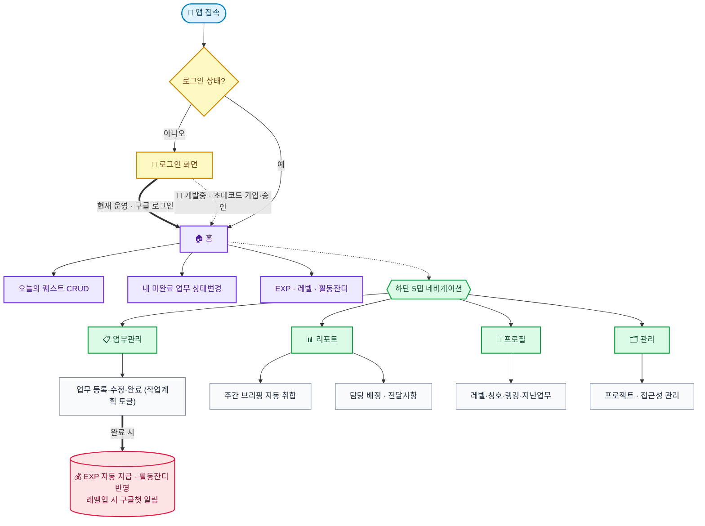
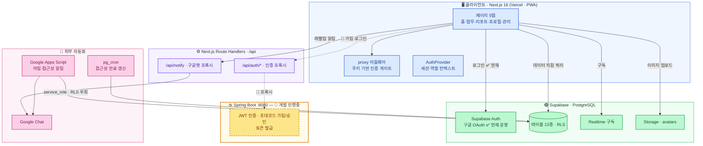
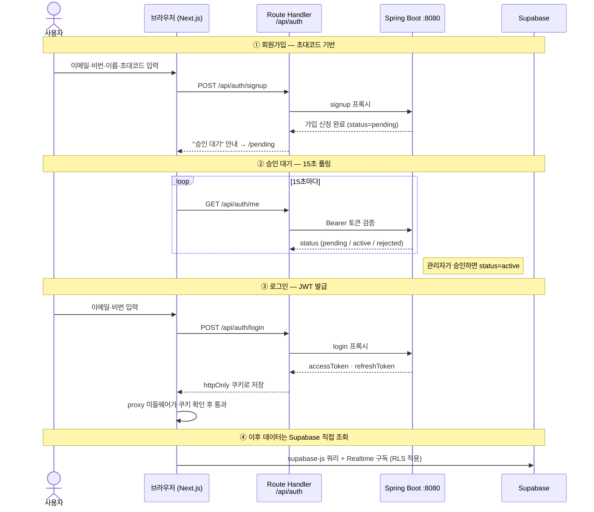
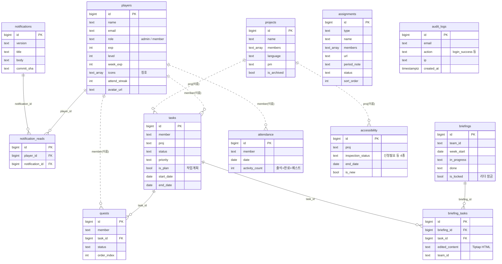

# 🧩 UD2팀 업무 관리 앱

> UD2 퍼블리싱팀 전용 업무 관리 웹앱  
> 업무 등록 → 자동 취합 → 주간 브리핑까지 한 곳에서

**🔗 배포 URL:** https://project-alarm-service.vercel.app  
**🔒 접근:** 허가된 UD2팀 구글 계정으로 로그인 (현재 운영)  
> 🚧 초대코드 회원가입 → 관리자 승인 방식은 **개발 진행 중**이라 아직 출시되지 않았어요.
**📱 PWA:** 홈 화면 / 작업 표시줄에 앱으로 설치 가능

---

## 🗺️ 한눈에 보기

> 처음 보는 사람도 "어떤 서비스인지" 흐름으로 파악할 수 있는 사용자 동선이에요.
> 
> 🟦 진입 · 🟨 인증 · 🟪 홈 · 🟩 5탭 기능 · 🟥 보상



---

## 📌 주요 기능

### 🏠 홈
- 본인 EXP / 레벨 / 출석 체크 현황
- 활동 잔디 히트맵 (출석 + 업무 완료 + 퀘스트 완료 합산)
- 오늘의 퀘스트 CRUD (추가 / 수정 / 삭제 / 완료)
  - "+ 추가" 버튼 모달로 등록 (프로젝트 react-select 검색 연동, Tiptap 내용 편집)
  - 오늘 기간에 걸친 내 업무는 퀘스트 목록에 자동 포함 (개별 제외 가능)
  - 드래그로 퀘스트 순서 변경 (정렬)
  - 마감 임박(D-3 이내) 퀘스트 강조
- 내 미완료 업무 목록 (상태 변경 가능)
- 레벨업 시 confetti 애니메이션 + 팀 전체 구글챗 알림
- 완료/퀘스트/출석 시 EXP 팝업 애니메이션

### 📋 업무 관리
- 업무 추가 / 수정 / 삭제
- 담당자 / 구분 / 우선순위 / 기간 / 공수 설정
- **작업 계획 토글** — 다음 주 예정 업무 등록, 주간 브리핑에 자동 포함
- DayPicker로 기간 선택 (연/월 드롭다운 지원)
- 상태 변경 (대기 → 시작 전 → 진행중 → 지연/보류 → 완료)
- 완료 시 EXP 자동 지급 + 활동 잔디 반영
- **이번 주(목~목) 기준** 필터링 (작업 계획 타입은 항상 표시)
- Realtime 동기화
- **권한:** 본인 업무만 수정/삭제 (관리자는 전체)

### 📊 리포트
- 주간 / 월간 탭 전환
- **주간 전달사항** — 관리자가 Tiptap 에디터로 작성 (B/I/H1/H2/목록 지원)
- **주간 브리핑** — 등록된 업무 기반 자동 생성
  - 프로젝트 / 유지보수 / 기타 / 작업 계획 섹션 자동 취합
  - **목요일 00:00~18:00** 에만 편집 가능 (편집 버튼으로 토글)
  - 섹션별 Copy 버튼 (노션 붙여넣기 지원)
- **담당 배정** — 배정현황 / 배정대기 관리
  - URL 하이퍼링크 지원
  - 배정대기 사업기간 메모
  - Copy 버튼으로 전체 복사
- 팀원별 상세 아코디언

### 👤 프로필
- 레벨 / EXP / 출석 체크
- 획득한 칭호 배지 표시
- EXP 랭킹 (이번 달 기준)
- 이번 주 팀원별 공수 바
- 지난 업무 조회 (기간 / 프로젝트 / 상태 필터)
- 탭 구성: 내 정보 · 지난 업무 · 완료 퀘스트(되돌리기 가능) · 성장(레벨 가이드 + 획득·미획득 칭호)
- 프로필 이미지 업로드 (인스타그램 스타일 액션 시트)

### 🗂️ 관리
- **프로젝트 관리**
  - 팀 전체 프로젝트 목록 (담당자 / 언어 / PM / 개발자 / 디자이너 / 빈도 / 이전담당 / 비고)
  - 아코디언 UI + 검색 / 담당자 / 언어 필터 + 가나다순 / 담당자순 정렬
  - react-select 검색 연동
- **접근성 관리**
  - 팀 전체 접근성 인증 현황
  - 상태: 신청필요 / 신청완료 / 취득·갱신완료 / 신청불필요
  - D-14 이내 빨간 강조, D-15~45 주황 강조
  - 신규 프로젝트 NEW 배지
  - pg_cron으로 만료 D-60에 자동 신청필요 변경
  - GAS 알림: 신청필요 상태 D-45 이내 개인 DM 발송

---

## 🎮 게이미피케이션

업무를 재미있게! 메이플스토리에서 영감받은 레벨 시스템이에요.

### ⚔️ 레벨 시스템

| 레벨 | 이름 | 필요 EXP |
|------|------|----------|
| Lv.1 | 🌱 풋내기 모험가 | 0 |
| Lv.2 | 🗡️ 수련 중인 검사 | 500 |
| Lv.3 | 🛡️ 던전 탐험가 | 1,500 |
| Lv.4 | ✨ 이름난 용병 | 3,000 |
| Lv.5 | 🔥 보스 사냥꾼 | 7,000 |
| Lv.6 | 💎 아케인 리버 개척자 | 15,000 |
| Lv.7 | 🌟 메이플 월드의 전설 | 35,000 |
| Lv.8 | 👑 검은 마법사의 숙적 | 70,000 |

### 💰 EXP 획득 방법

| 행동 | 획득 EXP |
|------|----------|
| 업무 완료 | +50 EXP |
| 긴급 업무 완료 | +100 EXP |
| 출석 체크 | +20 EXP |
| 퀘스트 완료 | +10 EXP |

> 레벨업 시 confetti 애니메이션 + 구글챗 팀 전체 축하 알림! 🎊

### 🏆 칭호 시스템

| 칭호 | 조건 |
|------|------|
| 🌱 첫 완료 | 첫 번째 업무 완료 |
| 🔥 꾸준러 | 3일 연속 출석 |
| ⚡ 주간 챔피언 | 7일 연속 출석 |
| ⏰ 마감지킴이 | D-day 전 완료 5건 |
| 💪 업무 달인 | 완료 10건 |
| 🏆 베테랑 | 완료 30건 |
| 🚨 긴급 해결사 | 긴급 업무 5건 완료 |
| ⭐ 중급 탐험가 | 레벨 5 달성 |

### 🌿 활동 잔디
- 출석 체크 / 업무 완료 / 퀘스트 완료 합산
- GitHub 잔디처럼 16주 히트맵으로 시각화
- 활동량에 따라 색상이 진해짐 (연초록 → 진초록)
- Realtime 반영

### 🏆 주간 MVP
- 매주 월요일 앱 접속 시 지난주 MVP 자동 선정
- 주간 EXP + 완료 업무 수 합산 기준
- confetti 오버레이로 축하 표시

---

## 🤖 자동화 (GAS)

Google Apps Script로 구글챗 자동 알림을 운영해요.

### 📨 아침 알림 (평일 오전 8-9시)
- **개인 DM**으로 발송
- 오늘의 퀘스트 목록 (마감일 포함)
- 진행중인 업무 목록 (🚨 D-day / ⚠️ D-3 이내 강조)
- 주말 / 한국 공휴일 자동 제외

### 🌐 접근성 만료 알림
- **개인 DM**으로 발송
- 신청필요 상태 + D-45 이내 자동 발송
- D-day 또는 기한 초과 🚨, D-3 이내 ⚠️

### 🎊 레벨업 알림
- 레벨업 시 **팀 전체 채팅**으로 자동 발송

---

## 🏗 시스템 아키텍처

> 프로그래밍 관점에서 본 전체 구조예요.
> **현재 운영(main 출시본)** 은 클라이언트가 **Supabase에 직접 쿼리**(supabase-js + Realtime + RLS)하고,
> 로그인은 **Supabase 구글 OAuth**를 씁니다.
> 단, **점수(EXP·레벨·출석·잔디) 쓰기는 DB의 `SECURITY DEFINER` RPC**(`set_task_status`·`set_quest_done`·`attendance_check`)를 통해서만 이뤄져요 — 클라이언트의 점수 직접 쓰기는 차단(위조 방지).
> 🚧 점선·노란 블록(**Spring Boot 인증**)은 별도 브랜치에서 **개발 진행 중**이라 아직 출시되지 않았어요.



### 🔐 인증 흐름 — 🚧 개발 진행중 (출시 전)

> ⚠️ 아래 **초대코드 가입 → 승인 → JWT** 흐름은 별도 브랜치에서 개발 중이며,
> **아직 사용자에게 적용되지 않았어요.** 현재 main 출시본의 로그인은 **Supabase 구글 OAuth**입니다.



### 🗄 DB ER 다이어그램

> 실선(`||--o{`)은 외래키(FK) 관계, 점선(`||..o{`)은 이름·프로젝트명 문자열로 느슨하게 연결되는 관계예요.
> 대부분의 테이블은 `team_id`(text)로 팀을 구분합니다.
>
> 🚧 **FK 정규화 진행 중:** 점선(이름 문자열 조인) 관계를 `player_id`/`project_id` FK로 전환하는 작업이 진행 중이에요(Phase 1 완료 — `tasks`·`quests`·`attendance`·`accessibility`에 FK 컬럼 추가·백필·검증·동기화 트리거). 클라이언트 전환·텍스트 컬럼 제거가 끝나면 아래 점선들이 실선 FK로 바뀝니다.



---

## 🛠 기술 스택

| 분야 | 기술 |
|------|------|
| 프레임워크 | Next.js 16 (App Router) |
| 언어 | TypeScript |
| 스타일링 | Tailwind CSS |
| 데이터베이스 | Supabase (PostgreSQL) |
| 인증 (현재 운영) | Supabase Auth (Google OAuth) |
| 인증 (🚧 개발중) | Spring Boot JWT · 초대코드 가입/승인 + Route Handler 프록시 |
| 실시간 | Supabase Realtime |
| 배포 | Vercel (프론트) |
| 자동화 | Google Apps Script |
| 에디터 | Tiptap |
| 날짜 선택 | React DayPicker |
| 검색 Select | react-select |
| 드래그앤드롭 | @dnd-kit/core |
| 애니메이션 | Framer Motion + canvas-confetti |
| PWA | manifest.json + 아이콘 |
| 아이콘 | Remix Icon |

---

## 📁 프로젝트 구조

```
src/
├── proxy.ts                  # 미들웨어: 쿠키 기반 인증 게이트 (로그인 안 하면 /login)
├── app/
│   ├── page.tsx              # 홈 (퀘스트, 내 업무, EXP, 잔디)
│   ├── tasks/                # 업무 관리 (수~수 기준 필터)
│   ├── report/               # 리포트 (브리핑, 배정현황, 전달사항)
│   ├── profile/              # 프로필 (내정보, 지난업무, 성장)
│   ├── manage/               # 관리 (프로젝트, 접근성)
│   ├── changelog/            # 배포/버전 업데이트 소식
│   ├── login/ · signup/      # 로그인 / 초대코드 회원가입
│   ├── pending/page.tsx      # 승인 대기 (15초 폴링 → /api/auth/me)
│   ├── auth/callback/route.ts
│   └── api/
│       ├── auth/             # login·signup·me·refresh·logout → Spring Boot 프록시
│       ├── notify/route.ts   # 구글챗 웹훅 프록시
│       └── briefing-tasks/route.ts
├── components/
│   ├── Nav.tsx · Header.tsx · UserMenu.tsx       # 네비게이션/헤더
│   ├── AuthProvider.tsx · AuthGuard.tsx          # 인증 컨텍스트/보호
│   ├── auth/                                      # 로그인·가입 픽셀 UI 위젯
│   ├── Avatar.tsx · AttendanceHeatmap.tsx        # 아바타/활동 잔디
│   ├── LevelUpOverlay.tsx · MvpOverlay.tsx · ExpPopup.tsx  # 게이미피케이션 연출
│   ├── TaskEditModal.tsx                          # 업무 편집 모달 (DragQuestModal.tsx는 현재 미사용)
│   └── Tiptap*Editor.tsx · NotificationButton.tsx
├── hooks/useNotifications.ts # 배포 알림 구독/읽음
└── lib/
    ├── supabase.ts           # Supabase 클라이언트 (데이터 직접 쿼리)
    ├── api.ts                # Spring Boot 백엔드 fetch 래퍼 (인증 전용)
    ├── auth.ts               # 인증 유틸 (이메일→팀원명, GUEST 처리)
    ├── maple.ts              # EXP/레벨/잔디 로직
    ├── types.ts · constants.ts · utils.ts
    ├── reactSelectStyles.ts  # react-select 공통 스타일
    └── googleChat.ts         # 구글챗 웹훅
```

---

## 🗄 Supabase 테이블

| 테이블 | 설명 |
|--------|------|
| `tasks` | 업무 목록 (is_plan 작업계획 포함) |
| `players` | 팀원 EXP / 레벨 / 칭호 / 주간 EXP |
| `projects` | 프로젝트 목록 (멀티 담당자, 메타데이터) |
| `accessibility` | 웹 접근성 인증 관리 (is_new, 상태 4종) |
| `quests` | 오늘의 퀘스트 (task_id 연동) |
| `briefings` | 주간 브리핑 저장본 (잠금 지원) |
| `assignments` | 배정현황 / 배정대기 (URL, 사업기간 메모) |
| `attendance` | 활동 잔디 기록 (activity_count) |
| `briefing_tasks` | 업무별 브리핑 카드 편집본 (Tiptap HTML) |
| `notifications` / `notification_reads` | 배포·버전 업데이트 알림 + 읽음 처리 |
| `audit_logs` | 로그인 감사 로그 (login_success / failed / logout) |

모든 테이블 RLS 활성화. GAS는 `service_role key`로 RLS 우회.
> ER 다이어그램은 위 [🗄 DB ER 다이어그램](#-db-er-다이어그램) 참고.

---

## 👥 권한 구조

| 역할 | 조건 | 권한 |
|------|------|------|
| `admin` | players.role = 'admin' | 전체 수정/삭제, 브리핑 잠금, 전달사항 편집 |
| `member` | players.role = 'member' | 본인 업무/퀘스트 수정, 프로젝트/접근성 추가 |
| `guest` | @plani.co.kr 도메인, MEMBER_EMAILS 미포함 | 읽기 전용 |

---

## 🔐 보안

> 사내 업무 데이터를 다루는 만큼, 인증·인가·데이터 격리·감사 측면에서 다음 조치를 적용했어요.
> (✅ 현재 운영 / 🚧 개발 진행중 표기)

### 인증 · 세션
- ✅ **미들웨어 인증 게이트** (`src/proxy.ts`) — `/login`·`/signup`·`/pending`·`/auth/callback` 외 모든 경로는 로그인 세션이 없으면 자동 차단·리다이렉트
- ✅ **회사 도메인 + 멤버 화이트리스트 기반 접근** — `@plani.co.kr` 외 차단, 명단 미포함자는 읽기 전용 GUEST로 강등 (`src/lib/auth.ts`)
- 🚧 **JWT를 `httpOnly` + `secure`(prod) + `sameSite=lax` 쿠키로 저장** — JS로 토큰 탈취(XSS) 불가, CSRF 완화 (`src/app/api/auth/login·refresh`)
- 🚧 **토큰을 브라우저에 직접 노출하지 않음** — Next.js Route Handler가 Spring Boot로 프록시, 토큰은 서버 경유만 (`src/lib/api.ts`)
- 🚧 **초대코드 가입 → 관리자 승인(pending) 2단계** — 무단 가입 차단, 승인 전엔 워크스페이스 진입 불가

### 인가 · 데이터 격리
- ✅ **역할 기반 접근 제어 (admin / member / guest)** — 본인 업무·퀘스트만 수정, 관리자만 전체 편집·브리핑 잠금 (`AuthProvider`, `AuthGuard`)
- ✅ **Supabase RLS(Row Level Security) 활성화** — 모든 테이블에 적용, 클라이언트는 `anon key`만 사용
- ✅ **`auth.jwt()` 기반 본인 데이터 정책** — 예: 알림 읽음·감사 로그는 본인 이메일 행만 접근 (`db/V4_audit_logs.sql`, `db/V8_notifications.sql`)
- ✅ **`service_role` 키는 앱 코드에서 미사용** — RLS를 우회하는 강력 키는 서버측 자동화(GAS)에서만 사용, 프론트엔드에는 절대 포함하지 않음

### 전송 · 응답 헤더
- ✅ **보안 응답 헤더 적용** (`next.config.ts`) — 모든 경로에:
  - `X-Frame-Options: SAMEORIGIN` (클릭재킹 방지), `X-Content-Type-Options: nosniff` (MIME 스니핑 차단)
  - `Referrer-Policy: strict-origin-when-cross-origin`, `Permissions-Policy`로 카메라·마이크·위치 등 미사용 기능 차단
  - `Strict-Transport-Security`(HSTS)로 HTTPS 강제
- ✅ **DB 레벨 쓰기 권한 강제 (RLS)** — `tasks`·`quests`는 본인/관리자만 수정·삭제, 게스트 쓰기 차단 (`db/V11_rls_write_policies.sql`)
- ✅ **점수 로직 서버화 (RPC)** — EXP·레벨·출석·잔디 계산/기록을 `SECURITY DEFINER` RPC(`set_task_status`·`set_quest_done`·`attendance_check`)로 단일화하고, 클라이언트의 `players` 점수 컬럼 직접 쓰기를 컬럼 권한으로 차단 → **점수 위조 불가** (`db/V12_score_logic_server.sql`)

### 감사 · 비밀 관리
- ✅ **감사 로그(`audit_logs`)** — 로그인 성공 / 로그아웃 시 이메일·IP·User-Agent 기록 (역방향 프록시 헤더 `x-forwarded-for` 고려)
- ✅ **환경변수 공개 범위 분리** — 클라이언트 노출은 `NEXT_PUBLIC_*` 만, 서버 전용 값(`API_URL`, `GOOGLE_CHAT_WEBHOOK`)은 비공개
- ✅ **비밀 미커밋** — `.gitignore`의 `.env*` 로 모든 환경파일 git 추적 제외 (코드 내 하드코딩된 시크릿 없음)

---

## ⚙️ 환경 변수

```env
# Supabase (데이터·실시간)
NEXT_PUBLIC_SUPABASE_URL=
NEXT_PUBLIC_SUPABASE_ANON_KEY=

# Spring Boot 인증 백엔드
API_URL=                       # 서버사이드용 내부 URL (예: http://api:8080)
NEXT_PUBLIC_API_URL=           # 클라이언트 fallback URL
NEXT_PUBLIC_SITE_URL=          # OAuth 콜백 등 사이트 베이스 URL

# 팀원/알림
NEXT_PUBLIC_MEMBER_EMAILS=이메일:이름,이메일:이름,...
GOOGLE_CHAT_WEBHOOK=
```

---

## 🚀 로컬 실행

```bash
git clone https://github.com/poseybutter/project-alarm-service.git
cd project-alarm-service
npm install

# .env.local 파일 생성 후 환경변수 입력
npm run dev
```

---

## 📱 PWA 설치

**Chrome (Windows / Mac)**
```
주소창 오른쪽 ⊕ 클릭 → 설치
작업 표시줄 / Dock에 고정 가능
```

**iPhone (Safari만 지원)**
```
공유 버튼(□↑) → 홈 화면에 추가
```

**Android**
```
Chrome 메뉴(⋮) → 앱 설치
```

---

## 🐛 버그 신고 / 기능 제안

[Issues 탭](https://github.com/poseybutter/project-alarm-service/issues)에서 제보해주세요!

| 라벨 | 설명 | 예시 |
|------|------|------|
| 🐛 `bug` | 버그, 오류 | Safari에서 select 색상 안 보임 |
| ✨ `feature` | 새 기능 요청 | 다크모드 지원 |
| 💄 `design` | UI/디자인 개선 | 모바일 레이아웃 깨짐 |
| 📚 `docs` | 문서, 설명 | 기능 안내 텍스트 수정 |

---

## 👥 팀원

| 이름 | 역할 |
|------|------|
| [조현석](https://github.com/hyunseokzzang) | 리더 / 관리자 |
| 이지은 | 개발 / 관리자 |
| 조정연 | 팀원 |
| 이헌희 | 팀원 |
